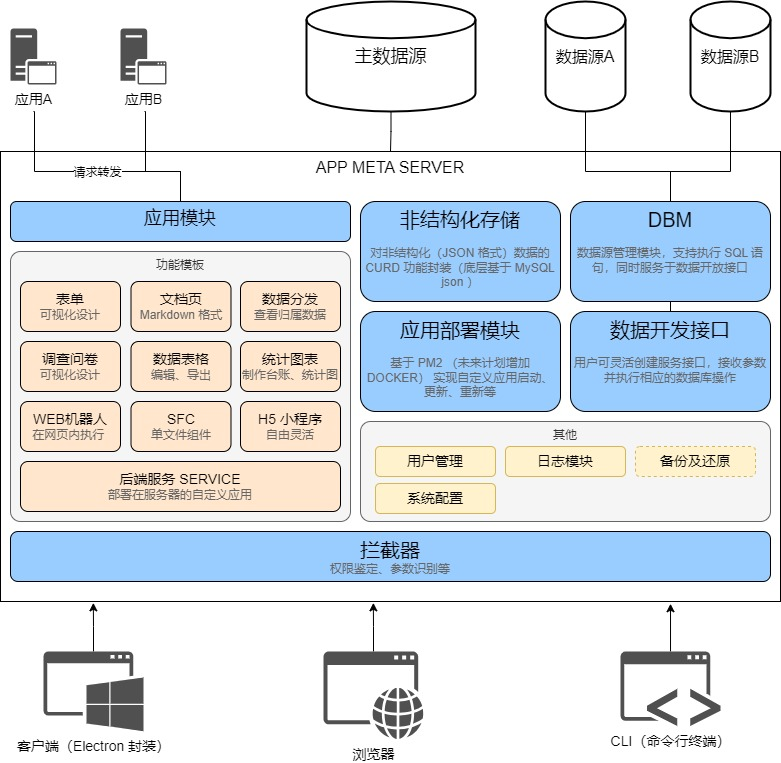

<div align=center>
<h1>🎉 应用元宇宙 / APP META 🎉</h1>


</div>

```text
 _______  _______  _______    __   __  _______  _______  _______ 
|   _   ||       ||       |  |  |_|  ||       ||       ||   _   |
|  |_|  ||    _  ||    _  |  |       ||    ___||_     _||  |_|  |
|       ||   |_| ||   |_| |  |       ||   |___   |   |  |       |
|       ||    ___||    ___|  |       ||    ___|  |   |  |       |
|   _   ||   |    |   |      | ||_|| ||   |___   |   |  |   _   |
|__| |__||___|    |___|      |_|   |_||_______|  |___|  |__| |__|
```

> 基于 [SpringBoot3](https://spring.io/projects/spring-boot) + [VUE3](https://cn.vuejs.org/) + [Naive UI](https://www.naiveui.com) + [Electron](https://www.electronjs.org) 应用快速开发、发布平台，旨在帮助使用者（包含但不限于开发人员、业务人员）快速响应业务需求，此仓库为前端，后端仓库详见[app-meta-server](https://github.com/0604hx/app-meta-server)。



可前往[screenshot](docs/screenshots)查看平台运行时截图。

## 开发说明
> 这是一个基于 [pnpm](https://pnpm.io/) 的 monorepo 项目，构建工具为 [webpack5](https://webpack.js.org/)

### 包说明
> 项目包存放于`packages`下

包名|说明
-|-
basic|基础函数、常量
cli|以命令行方式与后端进行交互
client|基于`electron`的客户端封装
library|工具库，为`ui`包、`小程序`等提供常用功能的一致性调用
server|开发阶段用于模拟 `CAS` 登录，基于 [fastify](https://www.fastify.io/)
ui|平台前端

### 启动命令

命令|说明
-|-
serve|启动`ui`项目（基于 webpack5、Vue3）
build|构建`ui`项目（用于部署上线）
client:start|启动`client`项目（基于 Electron）
client:watch|以热重载方式启动`client`（文件变动可自动重启进程）

使用 webpack5 启动，约 45 秒；Rspack(`0.3.14`) 启动，约 17 秒。

### 依赖
> `.npmrc` 文件指定了 electron 下载镜像

### 打包
> `2023-11-13`起迁移到[Rspack](https://www.rspack.dev/)，截至`0.3.11`版本，不支持中文路径😔

命令|说明|Rspack
-|-|-
build|打包`library`及`ui`，约耗时50s|8s
build|打包`cli（命令行工具）`，约耗时7s|580ms
build:library|单打打包`library`，约耗时9s|1s

以上统计数据来自设备

名称|参数
-|-
操作系统|windows 11
处理器|11th Gen Intel(R) i5-11300H 3.11 GHz
内存|16GB
node版本|20.8.0
webpack版本|5.89.0
rspack版本|0.3.11
```

## 附录

### 常见问题

#### electron 运行时控制台乱码

在控制台中执行`chcp 65001`，或者使用 `vite` 的 `createLogger` 组件 

详见：[PowerShell 中文乱码](https://www.cnblogs.com/lobtao/articles/14421673.html)

### Rspack配置
> 2023年12月起，构建工具迁移至[Rspack](https://www.rspack.dev/)

1. 请问如何配置 chunk 文件的存放目录
> 类似 vue-cli 的 assetsDir 配置项，如配置值位 `abc`， 达到的效果是将 js、css、img 等放置在 `dist/abc` 目录下

```text
chunkFilename 可以控制异步chunk位置，filename可以控制初始chunk位置

png 等文件可以通过https://webpack.js.org/configuration/module/#rulegeneratorfilename配置
```

2. 引入 echarts

为兼容 Rspack（截至0.4.2），需要全量引入 `import * as echarts from 'echarts'`，否则在生产环境下会报 echarts 未引入错误


### 补充说明

1. 仅为个人学习项目
