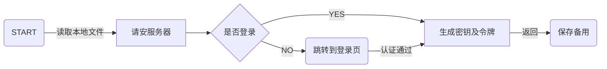

# 应用元宇宙 / APP META

<!-- TOC -->

- [应用元宇宙 / APP META](#%E5%BA%94%E7%94%A8%E5%85%83%E5%AE%87%E5%AE%99--app-meta)
- [架构设计](#%E6%9E%B6%E6%9E%84%E8%AE%BE%E8%AE%A1)
    - [数据交互](#%E6%95%B0%E6%8D%AE%E4%BA%A4%E4%BA%92)
        - [加解密方案](#%E5%8A%A0%E8%A7%A3%E5%AF%86%E6%96%B9%E6%A1%88)
        - [初始化流程](#%E5%88%9D%E5%A7%8B%E5%8C%96%E6%B5%81%E7%A8%8B)
        - [登录流程](#%E7%99%BB%E5%BD%95%E6%B5%81%E7%A8%8B)
- [应用 / Application](#%E5%BA%94%E7%94%A8--application)
    - [快应用 / FAST](#%E5%BF%AB%E5%BA%94%E7%94%A8--fast)
        - [表单页](#%E8%A1%A8%E5%8D%95%E9%A1%B5)
        - [数据展示](#%E6%95%B0%E6%8D%AE%E5%B1%95%E7%A4%BA)
        - [统计图表](#%E7%BB%9F%E8%AE%A1%E5%9B%BE%E8%A1%A8)
    - [小程序 / MICRO](#%E5%B0%8F%E7%A8%8B%E5%BA%8F--micro)
    - [外置应用 / EXTRA](#%E5%A4%96%E7%BD%AE%E5%BA%94%E7%94%A8--extra)
- [附录](#%E9%99%84%E5%BD%95)
    - [关于颜色](#%E5%85%B3%E4%BA%8E%E9%A2%9C%E8%89%B2)
    - [参考项目](#%E5%8F%82%E8%80%83%E9%A1%B9%E7%9B%AE)
    - [打包体积记录](#%E6%89%93%E5%8C%85%E4%BD%93%E7%A7%AF%E8%AE%B0%E5%BD%95)
        - [前端](#%E5%89%8D%E7%AB%AF)

<!-- /TOC -->

搭建多元化、本地化的应用平台，帮助开发人员快速产出解决用户问题的便捷应用程序，助力数字化转型。

# 架构设计

## 数据交互
> 客户端 Client 与服务端 Server 间采用 HTTP/HTTPS 协议进行数据通信，客户端使用 `got` 库（`axios` 在 nodejs 环境下对中文不友好）



### 加解密方案

客户端与服务端使用国密算法 SM4（对应 AES） + SM2（对应 RSA）混合加密。

客户端使用[gm-crypto](https://github[.com/byte-fe/gm-crypto)、[sm-crypto](https://github.com/JuneAndGreen/sm-crypto)，服务端使用[sm-crypto (JAVA)](https://github.com/antherd/sm-crypto)库。

### 初始化流程

1. 客户端启动
2. 读取数据目录下的`key.dat`文件，作为令牌（令牌为标准`JWT`格式，包含用户ID、IP、有效期等，如果文件不存在则弹窗提示）
3. 发送`请安`信息到服务端（按上述条约加密）
4. 服务端验证客户端信息，返回 `用户ID`、`部门ID`、`用户名`、`角色` 等信息
5. 客户端将上述用户信息保存到内存备用

### 登录流程

1. 客户端启动（加载 `loading.html` 页面）
2. 尝试读取数据目录下`key.dat`文件作为令牌（令牌为标准`JWT`格式，包含用户ID、IP、有效期等），附带到请求头的`UA`中
3. 发送启动信号给服务端

# 应用 / Application

应用程序 （Application）是平台的核心组成，旨在为用户解决实际问题。平台将应用分为三种：

序号 | 分类 | 说明 | 示例
---------|----------|---------|---------
1|快应用|利用平台自带的表单、数据展示模块快速实现数据录入、统计等需求，常用于数据填报/收集|投票、问卷调查、数据对比等
2|小程序|高度定制化的 Web 应用，能够解决`快应用`无法胜任的需求|
3|外置应用|跳转到外部应用，快速接入现有的网页应用|如对接大数据平台

*[应用程序]: 应用程序，指为完成某项或多项特定工作的计算机程序，它运行在用户模式，可以和用户进行交互，具有可视的用户界面。

## 快应用 / FAST

`快应用`通过提供模版，帮助用户快速发布页面以完成数据填报、展示、统计等。

模板|ID|说明|完成日期
-|-|-|-
表单页|form|数据填报页面，支持可视化编辑|2023-02-01
文档页|markdown|基于 MARKDOWN 的内容展示|2023-02-01
数据分发|data|批量导入数据并按照设定的规则分发|2023-03-16
码表维护|block|维护数据块|
调查问卷|wenjuan||2023-03-05
数据表格|table|以二维表格的形式展示数据|2023-02-17
统计图表|chart||
H5小程序|h5|自由灵活的 HTML5 页面|2023-02-16

详见`packages\ui\src\views\快应用\index.js`

### 表单页
> 开发者无需编写界面相关的代码，仅需通过配置`表单（Form）`即可自动生成数据填报页面。

`快应用`创建时，系统自动创建与之对应的表单页，同时作为应用的默认启用页。

### 数据展示
> 以表格的形式展示已经入库的数据。

### 统计图表
> TODO 🏗️

## 小程序 / MICRO

## 外置应用 / EXTRA

# 附录

## 关于颜色
> 主要讲述随机颜色，采用的是`潘通`发布的年度流行色

`Pantone色`，Pantone是美国著名的油墨品牌，已经成为印刷色的一个标准。它把自己生产的所有油墨都做成了色谱，色标，Pantone的色标因而成为公认的颜色交流的一种语言，用户需要某种颜色，就按色标标定就行。

<style>
.pantong {
    height: 32px;
    width: 32px;
}
</style>

年份|颜色名称|中文名|HEX|示例
-|-|-|-|-
2023|18-1750 Viva Magenta|非凡洋红|#BB2649|<div class='pantong' style='background:#BB2649'></div>
2022|17-3938 Very Peri|长春花蓝|#6667AB|<div class='pantong' style='background:#6667AB'></div>
2021 |17-5104 Ultimate Gray|极致灰|#939597|<div class='pantong' style='background:#939597'></div>
2021 |13-0647 Illuminating|亮丽黄|#F5DF4D|<div class='pantong' style='background:#F5DF4D'></div>
2020 |19-4052 Classic Blue|经典蓝|#0F4C81|<div class='pantong' style='background:#0F4C81'></div>
2019 |16-1546 Living Coral|活珊瑚橘|#FF6F61|<div class='pantong' style='background:#FF6F61'></div>
2018 |18-3838 Ultra Violet|紫外光|#5F4B8B|<div class='pantong' style='background:#5F4B8B'></div>
2017 |15-0343 Greenery|草木绿|#88B04B|<div class='pantong' style='background:#88B04B'></div>
2016 |13-1520 Rose Quartz|水晶粉|#F7CAC9|<div class='pantong' style='background:#F7CAC9'></div>
2016 |15-3919 Serenity|宁静蓝|#92A8D1|<div class='pantong' style='background:#92A8D1'></div>
2015 |18-1438 Marsala|玛萨拉酒红|#955251|<div class='pantong' style='background:#955251'></div>
2014 |18-3224 Radiant Orchid|璀璨紫兰花|#B565A7|<div class='pantong' style='background:#B565A7'></div>
2013 |17-5641 Emerald|翡翠绿|#009B77|<div class='pantong' style='background:#009B77'></div>
2012 |17-1463 Tangerine Tango|探戈橘|#E2492F|<div class='pantong' style='background:#E2492F'></div>
2011 |18-2120 Honeysuckle |忍冬红|#CB6586|<div class='pantong' style='background:#CB6586'></div>
2010 |15-5519 Turquoise|松石绿|#45B5AA|<div class='pantong' style='background:#45B5AA'></div>
2009|14-0848 Mimosa|含羞草黄|#F0C05A|<div class='pantong' style='background:#F0C05A'></div>
2008 |18-3943 Blue Iris|鸢尾蓝|#5A5B9F|<div class='pantong' style='background:#5A5B9F'></div>
2007 |19-1557 Chili Pepper|辣椒红|#9B1B30|<div class='pantong' style='background:#9B1B30'></div>
2006 |13-1106 SAND DOLLAR|沙色金币|#DECDBE|<div class='pantong' style='background:#DECDBE'></div>
2005 |15-5217 BLUE TURQUOISE|土耳其蓝|#53B0AE|<div class='pantong' style='background:#53B0AE'></div>
2004 |17-1456 TIGERLILY |虎皮百合橘|#E2583E|<div class='pantong' style='background:#E2583E'></div>
2003 |14-4811 AQUA SKY|水色天空|#7BC4C4|<div class='pantong' style='background:#7BC4C4'></div>
2002 |19-1664 TRUE RED |正红|#BF1932|<div class='pantong' style='background:#BF1932'></div>
2001 |17-2031 FUCHSIA ROSE|紫红玫瑰|#C74375|<div class='pantong' style='background:#C74375'></div>
2000 |15-4020 CERULEAN BLUE |蔚蓝色|#98B2D1|<div class='pantong' style='background:#98B2D1'></div>

```javascript
let pantongColors = ['#BB2649', '#6667AB', '#939597', '#F5DF4D', '#0F4C81', '#FF6F61', '#5F4B8B', '#88B04B', '#F7CAC9', '#92A8D1', '#955251', '#B565A7', '#009B77', '#E2492F', '#CB6586', '#45B5AA', '#F0C05A', '#5A5B9F', '#9B1B30', '#DECDBE', '#53B0AE', '#E2583E', '#7BC4C4', '#BF1932', '#C74375', '#98B2D1']

//随机返回一个颜色
function pantongColor(){
    return pantongColors[Math.floor(Math.random()*pantongColors.length)]
}
```

## 参考项目

项目名称|说明
-|-
[eoapi](https://github.com/eolinker/eoapi)|一个可拓展的 API 工具，简单（Easy） & 开源（OpenSource）的 API 生态系统

## 打包体积记录

### 前端

日期|原大小|压缩7z|说明
-|-|-|-
2022-12-13|4.2M|0.95M|基本功能
2022-12-13|4.6M|1.07M|增加代码编辑器`vue-codemirror`
2022-12-13|5.3M|1.13M|增加`@toast-ui/editor`的 Viewer
2022-12-13|6.1M|1.45M|增加`@toast-ui/editor`的 Viewer、Editor
