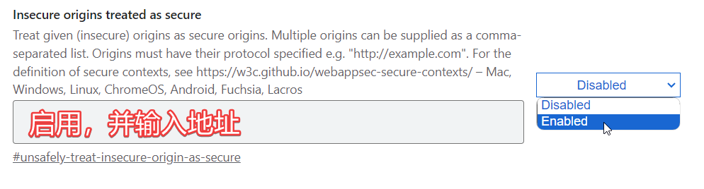

# 后端服务映射

快应用开发阶段，通过修改映射（保存到 localStorage 下 dev.service），可以促使 `H.service` 的请求直接发送到指定地址。

## 🚀如何开启

登录后，在右上角菜单，找到`配置 SERVICE 映射`（需要具备`DEVELOPER/开发者`权限），按照说明进行配置即可。

待功能上线后，需要撤销映射，否则服务可能无法正常使用。

## 🛡️关于 CORS
> 配置映射后，会出现跨源资源共享（CORS）问题，可以通过以下方法修正

由于浏览器的安全策略，映射后的请求后报错（CORS、Preflight 预检异常），此时可以通过以下方式解决：

### 1、修改后端服务代码
> 此方法适用于修改代码成本较低的场景

1. 允许 CORS，给响应头增加以下内容：
```shell
Access-Control-Allow-Origin: "请求的 ORIGIN 值"
Access-Control-Allow-Credentials: true
Access-Control-Allow-Headers: *
Access-Control-Allow-Methods: *
```
2. 允许 method=OPTIONS 的请求

#### 基于 Spring Boot 的配置方式
> 本示例在 3.x 版本实测通过，其他版本可能有所变动

```java
// 将以下 bean （配置 CORS）注册到 Spring Boot 即可
@Bean
public CorsFilter corsFilter(){
    UrlBasedCorsConfigurationSource source = new UrlBasedCorsConfigurationSource();

    CorsConfiguration config = new CorsConfiguration();
    config.addAllowedOrigin("*");
    config.addAllowedHeader("*");
    config.addAllowedMethod("*");
    // 设置为 true 时无法正常 CORS
    config.setAllowCredentials(false);

    source.registerCorsConfiguration("/**", config);
    return new CorsFilter(source);
}
```

#### 基于 Fastify 框架的配置方式

```javascript
const app = require('fastify')()

app.addHook('preHandler', (req, res, done)=>{
    // 开启 CORS
    res.header("Access-Control-Allow-Origin", req.headers.origin)
    res.header("Access-Control-Allow-Credentials", 'true')
    res.header("Access-Control-Allow-Headers", "*")
    res.header("Access-Control-Allow-Methods", "*")
    done()
})

// 允许所有 OPTIONS 类型的请求（通常是浏览器的预检策略）
app.options("/*", (req, res)=> res.send())
```

### 2、关闭浏览器的安全策略
> 此处以谷歌浏览器为例

修改谷歌快捷方式，增加启动参数`--disable-web-security`即可，建议单独配置一个关闭安全策略的浏览器（参考：[Windows下多Chrome谷歌浏览器版本共存](https://blog.csdn.net/ssrc0604hx/article/details/134081522)）。

## 其他问题

### the request client is not a secure context and the resource is in more-private address 'local'

此问题通常出现在非安全环境（如部署到非 https ），同时请求 localhost。有两个解决办法：

1. 配置浏览器白名单
    1. 浏览器访问`chrome://flags`
    2. 按照下图配置
    

2. 改用非 localhost 的地址，如 localhost 改成 `192.168.1.100`
